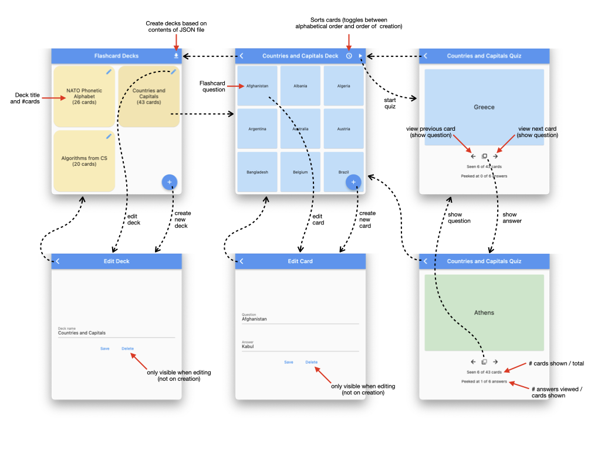

# Flashcards

## 1. Overview

A multi-page application that allows users to create, edit, and manage decks of two-sided flashcards (with nominal “questions” and “answers” on the two sides), and to run quizzes using cards drawn from a chosen deck.

Deck and flashcard information will be persisted to a local database, and the user interface is responsive to changes in screen size.

### 2 Feature overview

Here are the high-level features that the application supports:

1. Creating, editing, and deleting decks
2. Creating, editing, sorting, and deleting flashcards (associated with a specific deck)
3. Loading a “starter set” of decks and flashcards from the provided JSON file.
4. Persistence of all decks and flashcards across application restarts.
5. Running a “quiz” with all the flashcards in a specific deck

### 2.1 Behavioral specifications

The visual app storyboard below shows how the different pages of the app are connected.

Note that as the screen size increases, UI responds by merging the deck list and card list pages

#### 2.2 Deck list page

The default entry page of the app displays a scrollable list of decks, identified by their titles and listed in the order they were created. The current number of cards in the deck displayes alongside the deck title. Tapping on a deck takes you to its associated card list. There is secondary tap target (button) for each deck that allows you to edit and/or delete it.

There is a button for creating a new deck, which takes you to the deck editor screen.

There is a button for inserting decks based on the JSON file found in “assets/flashcards.json”.

#### 2.3 Deck editor

The deck editor screen allows the user to change the selected deck’s title. Saving the change persists it to the database. Deleting a deck  also deletes all its contained cards from the database.

#### 2.4 Card list

The card list page is displayed after selecting a deck, and shows a scrollable view of all the cards in the associated deck, identified by their “question” fields. The card is sortable alphabetically, and by their order of creation (oldest to newest).

Tapping on a card navigates to the card editor page.

There is a button that navigates to the quiz page.

#### 2.5 Card editor

The card editor page displays both the selected card’s “question” and “answer” fields, and allows both to be edited and saved. 

#### 2.6 Quiz

The quiz page allows the user to move through all the flashcards in the currently selected deck, displaying the questions by default, but allowing the user to “peek” at answers for knowledge review.

The flashcards are randomly shuffled upon arriving at the quiz page, and both forward and backward motion through the shuffled cards is possible (though the order of the cards will not change so long as quiz mode is not exited).

At all times, the number of cards viewed out of the total number of cards in the deck is displayed. Additionally, the number of answers that have been viewed out of the total number viewed is displayed.

#### 2.7 Responsiveness

App is responsive to changes in screen size.